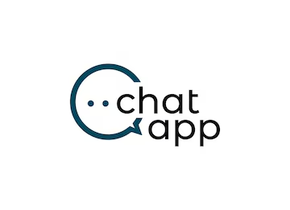

# **ChatApp Part 2**  
## **Real-Time Messaging with SignalR**

---

## **Persistent Message Storage**
### **Creating the `Message` Class**
I created a `Message` class that Entity Framework (EF) maps into a database table.

    

        Message.cs
        
        <button class="copy-button" aria-label="Copy code">
            <svg aria-hidden="true" focusable="false" class="octicon octicon-copy" viewBox="0 0 16 16" width="16" height="16" fill="currentColor" style="display:inline-block;user-select:none;vertical-align:text-bottom;overflow:visible">
                <path d="M0 6.75C0 5.784.784 5 1.75 5h1.5a.75.75 0 0 1 0 1.5h-1.5a.25.25 0 0 0-.25.25v7.5c0 .138.112.25.25.25h7.5a.25.25 0 0 0 .25-.25v-1.5a.75.75 0 0 1 1.5 0v1.5A1.75 1.75 0 0 1 9.25 16h-7.5A1.75 1.75 0 0 1 0 14.25Z"></path>
                <path d="M5 1.75C5 .784 5.784 0 6.75 0h7.5C15.216 0 16 .784 16 1.75v7.5A1.75 1.75 0 0 1 14.25 11h-7.5A1.75 1.75 0 0 1 5 9.25Zm1.75-.25a.25.25 0 0 0-.25.25v7.5c0 .138.112.25.25.25h7.5a.25.25 0 0 0 .25-.25v-7.5a.25.25 0 0 0-.25-.25Z"></path>
            </svg>
        </button>
    
 <!-- Closing code-header -->

    <pre><code class="updated-code">
        namespace ChatApp.Models
        {
            public class Message
            {
                public int Id { get; set; } // Primary key
                public string User { get; set; } // Username of the sender
                public string Content { get; set; } // The actual message content
                public DateTime Timestamp { get; set; } // When the message was sent
            }
        }
    </code></pre>

 <!-- Closing code-block -->

---

    

        ChatHub.cs
        <button class="expand-button" aria-label="Expand all lines">
            <svg aria-hidden="true" focusable="false" class="octicon octicon-unfold" viewBox="0 0 16 16" width="16" height="16" fill="currentColor" style="display: inline-block; user-select: none; vertical-align: text-bottom; overflow: visible;"><path d="m8.177.677 2.896 2.896a.25.25 0 0 1-.177.427H8.75v1.25a.75.75 0 0 1-1.5 0V4H5.104a.25.25 0 0 1-.177-.427L7.823.677a.25.25 0 0 1 .354 0ZM7.25 10.75a.75.75 0 0 1 1.5 0V12h2.146a.25.25 0 0 1 .177.427l-2.896 2.896a.25.25 0 0 1-.354 0l-2.896-2.896A.25.25 0 0 1 5.104 12H7.25v-1.25Zm-5-2a.75.75 0 0 0 0-1.5h-.5a.75.75 0 0 0 0 1.5h.5ZM6 8a.75.75 0 0 1-.75.75h-.5a.75.75 0 0 1 0-1.5h.5A.75.75 0 0 1 6 8Zm2.25.75a.75.75 0 0 0 0-1.5h-.5a.75.75 0 0 0 0 1.5h.5ZM12 8a.75.75 0 0 1-.75.75h-.5a.75.75 0 0 1 0-1.5h.5A.75.75 0 0 1 12 8Zm2.25.75a.75.75 0 0 0 0-1.5h-.5a.75.75 0 0 0 0 1.5h.5Z"></path></svg>
        </button>
        <button class="copy-button" aria-label="Copy code">
            <svg aria-hidden="true" focusable="false" class="octicon octicon-copy" viewBox="0 0 16 16" width="16" height="16" fill="currentColor">
                <path d="M0 6.75C0 5.784.784 5 1.75 5h1.5a.75.75 0 0 1 0 1.5h-1.5a.25.25 0 0 0-.25.25v7.5c0 .138.112.25.25.25h7.5a.25.25 0 0 0 .25-.25v-1.5a.75.75 0 0 1 1.5 0v1.5A1.75 1.75 0 0 1 9.25 16h-7.5A1.75 1.75 0 0 1 0 14.25Z"></path>
                <path d="M5 1.75C5 .784 5.784 0 6.75 0h7.5C15.216 0 16 .784 16 1.75v7.5A1.75 1.75 0 0 1 14.25 11h-7.5A1.75 1.75 0 0 1 5 9.25Zm1.75-.25a.25.25 0 0 0-.25.25v7.5c0 .138.112.25.25.25h7.5a.25.25 0 0 0 .25-.25v-7.5a.25.25 0 0 0-.25-.25Z"></path>
            </svg>
        </button>
    

    
    

        <!-- Updated Code (Always Visible) -->
<pre class="updated-code">
<code>         
      using ChatApp.Models;  
  
    using Microsoft.AspNetCore.SignalR;
    public class ChatHub : Hub
    {
    
    
          namespace ChatApp.Hubs  
         {   
        private readonly AppDbContext _context;  
        public ChatHub(AppDbContext context)  
        {  
        _context = context;  
        }  

       public async Task SendMessage(string user, string message)
       {
       
       
           var newMessage = new Message
           {
               User = user,
               Content = message,
               Timestamp = DateTime.UtcNow
           };

           _context.Messages.Add(newMessage);
           await _context.SaveChangesAsync();

               await Clients.All.SendAsync("ReceiveMessage", user, message);
       }
    }
    
</code>
</pre>

    

---

### **Tracking Online Users & Notifications**
Chat now displays **online users** and **notifies when users join or leave**.

    

        ChatHub.cs
        <button class="copy-button" aria-label="Copy code">📋 Copy</button>
    

    <pre><code class="updated-code">public override async Task OnConnectedAsync()
{
    string userName = Context.User.Identity.Name;

    if (!OnlineUsers.ContainsKey(Context.ConnectionId))
    {
        OnlineUsers[Context.ConnectionId] = userName;
        await Clients.All.SendAsync("UserJoined", userName);
        await SendOnlineUsers();
    }

    await base.OnConnectedAsync();
}

public override async Task OnDisconnectedAsync(Exception exception)
{
    if (OnlineUsers.TryRemove(Context.ConnectionId, out string userName))
    {
        await Clients.All.SendAsync("UserLeft", userName);
        await SendOnlineUsers();
    }

    await base.OnDisconnectedAsync(exception);
}

private async Task SendOnlineUsers()
{
    var users = OnlineUsers.Values.Distinct().ToList();
    await Clients.All.SendAsync("UpdateOnlineUsers", users);
}</code></pre>

---

This update ensures all code blocks have **GitHub-style headers and copy buttons** while maintaining correct formatting for **HTML entities** in Markdown. Let me know if you need any further refinements! 🚀

