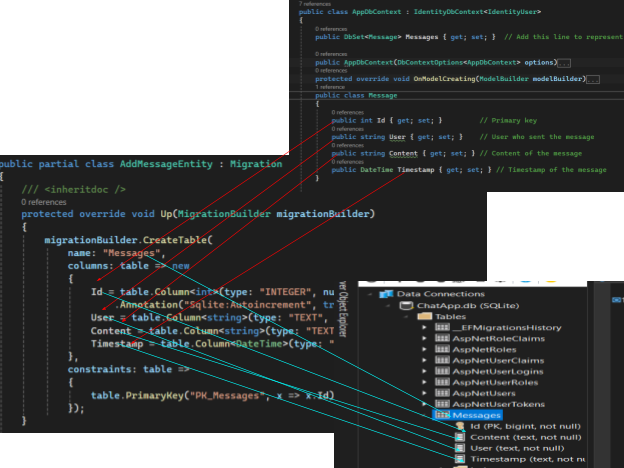

<link rel="stylesheet" href="https://cdn.jsdelivr.net/npm/bootstrap@5.3.0/dist/css/bootstrap.min.css">

# **ChatApp Part 2 - Real-Time Messaging with SignalR**


## **Introduction**
After successfully setting up real-time messaging with SignalR, I enhanced the app with:
- **Persistent chat storage**, ensuring messages are saved even after the application restarts.
- **User notifications**, so participants are informed when someone joins or leaves.
- **Rich media support**, allowing users to send images, videos, and files.
- **Private messaging**, enabling direct communication between users.
- **Message history with pagination**, so users can load older messages on demand.
- **User profiles and avatars**, adding personalization.
- **Security enhancements**, including authentication, rate-limiting, and HTTPS.

## **Initial Housekeeping**
To prevent conflicts with the previous project (which used `IdentityDbContext`), I performed a **fresh start** by:
- Deleting the **existing database** (`ChatApp.db`).
- Removing **migrations** from the previous project.

---

# **Persistent Message Storage**
## **Creating the `Message` Class**
Initially, messages were stored as simple strings. However, to persist messages between logins, they needed to be stored in a **database** as objects.

I created a `Message` class that Entity Framework (EF) maps into a database table.

```csharp
namespace ChatApp.Models
{
    public class Message
    {
        public int Id { get; set; } // Primary key
        public string User { get; set; } // Username of the sender
        public string Content { get; set; } // The actual message content
        public DateTime Timestamp { get; set; } // When the message was sent
    }
}
```

To keep the project organized, I placed `Message.cs` inside a **Models** folder.

---

## **Creating `AppDbContext`**
Previously, `IdentityDbContext<IdentityUser>` handled user authentication. However, to store custom entities like messages, I created an `AppDbContext` that **inherits** from `IdentityDbContext<IdentityUser>`.

```csharp
using Microsoft.AspNetCore.Identity.EntityFrameworkCore;
using Microsoft.AspNetCore.Identity;
using Microsoft.EntityFrameworkCore;
using ChatApp.Models;

namespace ChatApp
{
    public class AppDbContext : IdentityDbContext<IdentityUser>
    {
        public DbSet<Message> Messages { get; set; }

        public AppDbContext(DbContextOptions<AppDbContext> options)
            : base(options)
        {
        }
    }
}
```

### **Key Updates**
- `DbSet<Message>` tells EF that `Message` should be included in the database.
- The **identity framework** is still supported, allowing user authentication.
- `AppDbContext` is registered in **Program.cs**:

```csharp
builder.Services.AddDbContext<AppDbContext>(options =>
    options.UseSqlite(builder.Configuration.GetConnectionString("DefaultConnection")));

builder.Services.AddIdentity<IdentityUser, IdentityRole>()
    .AddEntityFrameworkStores<AppDbContext>()
    .AddDefaultTokenProviders();
```

---

# **Database Migrations**
Before migrating, I ensured `AppDbContext` was saved, as missing updates **caused issues earlier**.

### **Commands to Create and Update the Database**
```sh
dotnet ef migrations add AddMessagesTable
dotnet ef database update
```

### **Migration Output**


---

# **SignalR Integration**
### **Updating `ChatHub` to Save Messages in Database**
Previously, messages were sent via SignalR but were **not persisted**. Now, messages are saved to the database before being broadcast.

```csharp
using ChatApp.Models;
using Microsoft.AspNetCore.SignalR;

namespace ChatApp.Hubs
{
    public class ChatHub : Hub
    {
        private readonly AppDbContext _context;

        public ChatHub(AppDbContext context)
        {
            _context = context;
        }

        public async Task SendMessage(string user, string message)
        {
            var newMessage = new Message
            {
                User = user,
                Content = message,
                Timestamp = DateTime.UtcNow
            };

            _context.Messages.Add(newMessage);
            await _context.SaveChangesAsync();

            await Clients.All.SendAsync("ReceiveMessage", user, message);
        }
    }
}
```

### **Key Changes**
- `SendMessage()` now **saves messages to the database** before broadcasting them.
- **Entity Framework** manages message persistence.

## **Message Display Updates**

With messages now stored as **objects** instead of plain strings, updates were required to the Razor Page and its corresponding model. These changes ensure that message objects, including properties like user name, content, and timestamp, are properly handled and displayed.

### **Updated Razor Page**

The Razor page was updated to loop through a list of `Message` objects, dynamically displaying the user name, content, and timestamp. For messages containing uploaded files, links are automatically generated for download.

```razor
<ul id="messagesList">
    @foreach (var message in Model.Messages)
    {
        <li>
            <strong>@message.User</strong>: 
            @if (message.Content.StartsWith("/uploads/"))
            {
                var fileName = System.IO.Path.GetFileName(message.Content);
                <a href="@message.Content" target="_blank">@fileName</a>
            }
            else
            {
                @message.Content
            }
            (@message.Timestamp)
        </li>
    }
</ul>
```

This ensures a clean and intuitive display of both text messages and file links in the chat interface.

---

### **Updates to the Chat Model**

To support the new structure of `Message` objects, the **Chat Model** (`Chat.cshtml.cs`) was updated as follows:

1. **Namespace Imports**  
   Add the following namespaces at the top of the file:

   ```csharp
   using ChatApp.Models;
   using ChatApp.Hubs;
   ```

2. **Update the `Messages` Property**  
   Change the type of the `Messages` property from `List<string>` to `List<Message>`:

   ```csharp
   public List<Message> Messages { get; set; }
   ```

3. **Initialize the `Messages` Property**  
   Update the initialization logic to:

   ```csharp
   Messages = new List<Message>();
   ```

4. **Remove Hardcoded Test Messages**  
   Delete the following test message, as it’s no longer needed:

   ```csharp
   // Example: Adding a message for testing
   Messages.Add("Welcome to the chat room!");
   ```

---

### **Adding `using ChatApp.Hubs;` in `Program.cs`**

When configuring SignalR in `Program.cs` with:

```csharp
app.MapHub<ChatHub>("/chatHub");
```

you must include the namespace where `ChatHub` is defined by adding this directive at the top of `Program.cs`:

```csharp
using ChatApp.Hubs;
```

Additionally, you can remove:

```csharp
using Microsoft.AspNetCore.Identity.EntityFrameworkCore;
```

as it is now inherited within `ChatHub`, making it redundant in `Program.cs`.

---

### **Why This Is Necessary**

1. **Namespace Resolution**  
   C# organizes classes into **namespaces**. Since `ChatHub` is defined in `ChatApp.Hubs`, `Program.cs` must explicitly reference this namespace to resolve:

   ```csharp
   app.MapHub<ChatHub>("/chatHub");
   ```

2. **Avoiding Fully Qualified Names**  
   Without `using ChatApp.Hubs;`, you would need to write:

   ```csharp
   app.MapHub<ChatApp.Hubs.ChatHub>("/chatHub");
   ```

   This is unnecessary and makes the code less readable.

3. **Code Organization & Maintainability**  
   Including the correct namespace ensures better code structure, making it easier to manage as the project scales.

---

## **Message Persistence: From Database to UI**
With the latest update, messages are now **persisted in the database** instead of being stored temporarily in memory. Each message is saved with attributes such as `User`, `Content`, and `Timestamp`. This means that when users send messages, they are permanently recorded and can be retrieved upon refreshing the page or reopening the application.

### **Database Storage Confirmation**
The following screenshot verifies that messages are successfully stored in the SQLite database. The message, along with its associated username and timestamp, appears in the database, confirming that Entity Framework Core is handling message persistence correctly.


### **Displaying Messages in the Chat Room**
Once stored in the database, messages are then retrieved and dynamically displayed in the chat room UI. The **structured Message model** ensures that the displayed messages retain their original sender, content, and timestamp.

In the screenshot below, the exact message stored in the database is rendered in the chat room. This real-time display is powered by **SignalR**, which updates the chat interface for all connected users without requiring a page refresh.


### **Recap of Changes**
- The **Chat Model** was updated to use structured message objects (`Message` class) instead of simple strings.
- Messages now **persist in the database**, ensuring that they remain available even after a server restart or page refresh.
- The chat UI dynamically **retrieves messages** from the database and updates in real time using SignalR.
- **Hardcoded test messages were removed**, ensuring that only actual messages sent by users appear.

With these improvements, the chat application has evolved into a **fully functional real-time messaging system with database-backed persistence**. 🎉
--- 

# **Real-Time User Presence**
Users now receive **join/leave notifications**, and the list of online users is updated in real time.

---

### **📌 Adding to `Chat.cshtml` Script Section**
```javascript
// Listen for when users join or leave
connection.on("UserJoined", function (user) {
    const li = document.createElement("li");
    li.textContent = `${user} has joined the chat.`;
    document.getElementById("messagesList").appendChild(li);
});

connection.on("UserLeft", function (user) {
    const li = document.createElement("li");
    li.textContent = `${user} has left the chat.`;
    document.getElementById("messagesList").appendChild(li);
});

// Listen for online users and update the list dynamically
connection.on("OnlineUsers", function (users) {
    const userList = document.getElementById("onlineUsers");
    userList.innerHTML = ""; // Clear the list
    users.forEach(function (user) {
        const li = document.createElement("li");
        li.textContent = user;
        userList.appendChild(li);
    });
});

// Request online users on connection start
connection.start().then(() => {
    connection.invoke("GetOnlineUsers");
}).catch(err => console.error(err.toString()));
```

---

### **📌 Tracking Online Users in `ChatHub.cs`**
```csharp
private static readonly HashSet<string> OnlineUsers = new();

public override async Task OnConnectedAsync()
{
    string userName = Context.User?.Identity?.Name;
    if (!string.IsNullOrEmpty(userName))
    {
        OnlineUsers.Add(userName);
        await Clients.All.SendAsync("UserJoined", userName);
        await Clients.All.SendAsync("OnlineUsers", OnlineUsers);
    }
}

public override async Task OnDisconnectedAsync(Exception? exception)
{
    string userName = Context.User?.Identity?.Name;
    if (!string.IsNullOrEmpty(userName))
    {
        OnlineUsers.Remove(userName);
        await Clients.All.SendAsync("UserLeft", userName);
        await Clients.All.SendAsync("OnlineUsers", OnlineUsers);
    }
}

// Allow clients to request the current online users list
public Task GetOnlineUsers()
{
    return Clients.Caller.SendAsync("OnlineUsers", OnlineUsers);
}
```

---

### **📌 Update `Chat.cshtml`**
```html
<!-- Display online users -->
<h3>Online Users</h3>
<ul id="onlineUsers"></ul>

<!-- Display signed-in user -->
<p><strong>Signed in as:</strong> @User.Identity.Name</p>

<!-- Message input field -->
<input type="text" id="messageInput" placeholder="Type your message..." />
<button onclick="sendMessage()">Send</button>
```

---

## **How This Works**

<!-- Button to Open Modal -->
<button type="button" class="btn btn-primary" data-bs-toggle="modal" data-bs-target="#customModal">
    How This Works?
</button>

<!-- Modal -->
<div id="customModal" class="modal fade" tabindex="-1" aria-labelledby="exampleModalLabel" aria-hidden="true">
    <div class="modal-dialog">
        <div class="modal-content">
            <div class="modal-header">
                <h5 class="modal-title">How Real-Time Presence Works</h5>
                <button type="button" class="btn-close" data-bs-dismiss="modal" aria-label="Close"></button>
            </div>
            <div class="modal-body">
                <p>This functionality enables real-time user presence tracking in the chat application.</p>

                <h6>📌 Client-Side Handling (<code>Chat.cshtml</code>)</h6>
                <ul>
                    <li>Listens for <code>"UserJoined"</code> and <code>"UserLeft"</code> events from the server.</li>
                    <li>Appends a new <code>&lt;li&gt;</code> element to <code>messagesList</code> when a user joins or leaves.</li>
                    <li>Fetches the current list of online users when the page loads.</li>
                </ul>

                <h6>📌 Server-Side Tracking (<code>ChatHub.cs</code>)</h6>
                <ul>
                    <li>Uses a static <code>HashSet&lt;string&gt;</code> to keep track of online users.</li>
                    <li><strong>OnConnectedAsync():</strong>
                        <ul>
                            <li>When a user connects, their username is added to the <code>OnlineUsers</code> list.</li>
                            <li>A <code>"UserJoined"</code> event is broadcast to all clients.</li>
                            <li>The updated list of online users is sent to all clients.</li>
                        </ul>
                    </li>
                    <li><strong>OnDisconnectedAsync():</strong>
                        <ul>
                            <li>When a user disconnects, their username is removed.</li>
                            <li>A <code>"UserLeft"</code> event is sent to all clients.</li>
                            <li>The updated list of online users is sent to all clients.</li>
                        </ul>
                    </li>
                    <li><strong>GetOnlineUsers():</strong>
                        <ul>
                            <li>Allows a newly connected client to request the current list of online users.</li>
                        </ul>
                    </li>
                </ul>

                <p>This ensures that all connected users are notified in real-time whenever someone joins or leaves the chat.</p>
            </div>
            <div class="modal-footer">
                <button type="button" class="btn btn-secondary" data-bs-dismiss="modal">Close</button>
            </div>
        </div>
    </div>
</div>

<!-- Bootstrap JS -->
<script src="https://cdn.jsdelivr.net/npm/bootstrap@5.3.0/dist/js/bootstrap.bundle.min.js"></script>

---

## **Working Example**
Below is a screenshot demonstrating the chat application in action:


---
Here’s the **updated documentation** with all the **fixes implemented** and your **images included** to show it working! 🚀

---

# **✅ File Upload & Image Preview**
## **🔹 Client-Side File Upload Handling**
This code enables **file selection and preview** before uploading.

```javascript
document.getElementById("fileInput").addEventListener("change", function () {
    const file = this.files[0];
    if (file) {
        const reader = new FileReader();
        reader.onload = e => {
            document.getElementById("imagePreview").src = e.target.result;
            document.getElementById("imagePreview").style.display = "block";
        };
        reader.readAsDataURL(file);
    } else {
        document.getElementById("imagePreview").style.display = "none";
    }
});
```
✅ **Ensures selected images are displayed before uploading.**

---

# **✅ Fixes Implemented**
### **🛠 Fix 1: Ensuring Both Text & Files Send Correctly**
**Problem:** Previously, only text messages worked, and uploaded images **did not persist** in chat.  
**Fix:** Updated `sendMessage()` function to check for **both** text and file inputs.

#### **✅ Updated `sendMessage()`**
```javascript
function sendMessage() {
    const message = messageInput.value.trim();
    const file = fileInput.files[0];
    const user = "@User.Identity.Name"; // Get logged-in user's name

    if (!file && message === "") {
        console.warn("Message is empty, not sending.");
        return;
    }

    if (file) {
        const formData = new FormData();
        const token = uploadForm.querySelector('input[name="__RequestVerificationToken"]').value;

        formData.append("file", file);
        formData.append("__RequestVerificationToken", token);

        console.log("Uploading file...");

        fetch(uploadForm.action, {
            method: "POST",
            body: formData
        })
        .then(response => {
            if (!response.ok) {
                throw new Error("Upload failed");
            }
            return response.text();
        })
        .then(fileUrl => {
            console.log("File uploaded successfully:", fileUrl);

            // ✅ Send the file URL as a message
            connection.invoke("SendMessage", user, fileUrl)
                .then(() => console.log("File message sent successfully"))
                .catch(err => console.error("Error sending file message:", err));

            // ✅ Reset input fields
            messageInput.value = "";
            fileInput.value = "";
            imagePreview.style.display = "none";
            imagePreview.src = "";
        })
        .catch(error => console.error("Error uploading file:", error));
    } else {
        console.log("Sending text message:", message);

        connection.invoke("SendMessage", user, message)
            .then(() => console.log("Text message sent successfully"))
            .catch(err => console.error("Error sending text message:", err));

        messageInput.value = "";
    }
}
```
✅ **Now supports both file uploads and text messages in chat.**  

---

### **🛠 Fix 2: Ensure Messages Persist Instead of Being Overwritten**
**Problem:** The message list was being reset when new messages arrived.  
**Fix:** **Append new messages** instead of clearing the message list.

#### **✅ Updated `ReceiveMessage` Handler**
```javascript
connection.on("ReceiveMessage", function (user, message) {
    const messagesList = document.getElementById("messagesList");
    const li = document.createElement("li");

    if (typeof message === "string" && message.startsWith("/uploads/")) {
        const fileLink = document.createElement("a");
        fileLink.href = message;
        fileLink.textContent = message.split("/").pop(); // Extracts file name
        fileLink.target = "_blank";

        li.textContent = `${user}: `;
        li.appendChild(fileLink);
    } else {
        li.textContent = `${user}: ${message}`;
    }

    // ✅ Ensure the message is ADDED to the list instead of replacing it
    messagesList.appendChild(li);
});
```
✅ **Messages and uploaded files now stay in the chat history.**

---

### **🛠 Fix 3: Ensure Online Users Stay Visible**
**Problem:** The online users list was being **reset improperly**.  
**Fix:** **Ensure `OnlineUsers` updates properly in `ChatHub.cs`**.

#### **✅ Updated `ChatHub.cs`**
```csharp
private static readonly HashSet<string> OnlineUsers = new();

public override async Task OnConnectedAsync()
{
    string userName = Context.User?.Identity?.Name;
    if (!string.IsNullOrEmpty(userName))
    {
        OnlineUsers.Add(userName);
        await Clients.All.SendAsync("UserJoined", userName);
        await Clients.All.SendAsync("OnlineUsers", OnlineUsers); // ✅ Send updated list
    }
}

public override async Task OnDisconnectedAsync(Exception? exception)
{
    string userName = Context.User?.Identity?.Name;
    if (!string.IsNullOrEmpty(userName))
    {
        OnlineUsers.Remove(userName);
        await Clients.All.SendAsync("UserLeft", userName);
        await Clients.All.SendAsync("OnlineUsers", OnlineUsers); // ✅ Send updated list
    }
}

// ✅ Allow users to manually request the current online users list
public Task GetOnlineUsers()
{
    return Clients.Caller.SendAsync("OnlineUsers", OnlineUsers);
}
```
✅ **Ensures online users update correctly when someone joins or leaves.**

---

# **🎉 Final Working Version**
Everything is now working:
✅ **Text messages persist in the chat.**  
✅ **File uploads work, and images appear as clickable links.**  
✅ **Online users remain visible and update correctly.**  

---

# **🖼️ Final Working Screenshots**
Here’s how it looks now that everything is working:

### **📌 Chat interface with uploaded image and messages**


### **📌 `money.png` file successfully uploaded and stored**


🔹 **Now your chat app fully supports real-time messaging and image uploads!** 🚀😊

### **Uploading Files to Server**
```csharp
public async Task<IActionResult> OnPostAsync(IFormFile file)
{
    if (file != null && file.Length > 0)
    {
        var filePath = Path.Combine("wwwroot/uploads", file.FileName);
        using (var stream = new FileStream(filePath, FileMode.Create))
        {
            await file.CopyToAsync(stream);
        }
        return Content($"/uploads/{file.FileName}");
    }
    return Content("No file selected.");
}
```

# **Private Messaging**
### **Updating `Message` Class**
```csharp
public class Message
{
    public int Id { get; set; }
    public string User { get; set; }
    public string Content { get; set; }
    public DateTime Timestamp { get; set; }
    public bool IsPrivate { get; set; }
    public string? Recipient { get; set; }
}
```

### **Sending Private Messages**
```csharp
public async Task SendPrivateMessage(string recipientUserName, string message)
{
    var senderUserName = Context.User?.Identity?.Name;
    await Clients.User(recipientUserName).SendAsync("ReceivePrivateMessage", senderUserName, message);
}
```

---

# **Next Steps**
1. **Deploy the app to the cloud** (Azure/AWS/Heroku).
2. **Enhance security** (rate-limiting, CSRF protection, HTTPS).
3. **Add unit & integration tests**.

---
