# ChatApp

After completing several Udemy courses on C#, rather than doing more, I felt it was time to build projects. I aimed to understand everything in this application and put it into my own words here. Instead of building it once and moving on to another project, I built the app repeatedly. Each time I restarted, I discovered more things I didn’t know. This made me realize that repeatedly working on the same project until fully understanding it might be more effective for learning.

I asked ChatGPT for a project idea to enhance my C# skills, and it suggested creating a ChatApp. This is a website where users can post messages and view messages from others in real-time, reminiscent of early online chat rooms from 20 years ago.

The app leverages SignalR, a package enabling real-time communication, which also incorporates asynchronous programming to ensure the application remains responsive while processing sent messages.

---

### Challenges and Outcomes

There were many challenges along the way. I spent hours debugging, only to realize that all POST forms need an anti-forgery token. I also spent considerable time learning about implementing `AppDbContext` only to realize it wasn’t necessary for my current setup.

This marks the first stage of the app, and I plan to expand its features over time. Through this project, I’ve gained valuable experience with:

- **ASP.NET Core**: Building robust web applications.
- **SignalR**: Real-time messaging functionality.
- **Authentication and Authorization**: Setting up secure systems.
- **Program.cs Structuring**: Organizing and initializing services and middleware.
- **Entity Framework Core**: Managing databases efficiently.

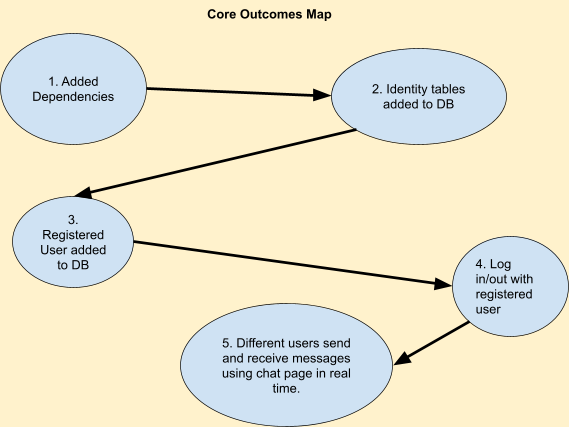
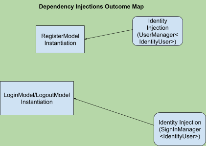

---

## SECTION 1: BUILDING THE PROJECT

### Project Template

In Visual Studio, I created a new project named `ChatApp` using **ASP.NET Core Web App (Razor Pages)**.

---

### Package Setup

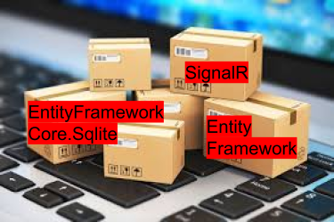

To enable users to register and log in, I needed to persist their information across sessions. For this, I installed **SQLite** as the database. I also integrated **ASP.NET Core Identity**, which provides built-in support for authentication and authorization. Finally, I incorporated **SignalR** for real-time messaging functionality.

---

### Adding Packages

Navigate to the directory with the `.csproj` file:
```shell
PS C:\Users\johnwalshe\source\repos\ChatApp\ChatApp>
```

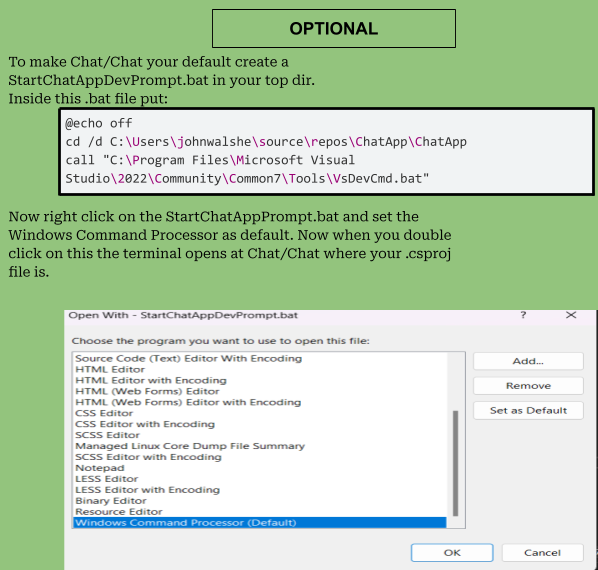

Using **.NET 8**, I ensured the packages were compatible:
```shell
dotnet add package Microsoft.AspNetCore.Identity.EntityFrameworkCore --version 8.0.0
dotnet add package Microsoft.EntityFrameworkCore.Sqlite --version 8.0.0
dotnet add package Microsoft.EntityFrameworkCore.Tools --version 8.0.0
dotnet add package Microsoft.AspNetCore.SignalR
```

I verified the installation:
```shell
dotnet list package
```

**Outcome 1**: Added Dependencies  
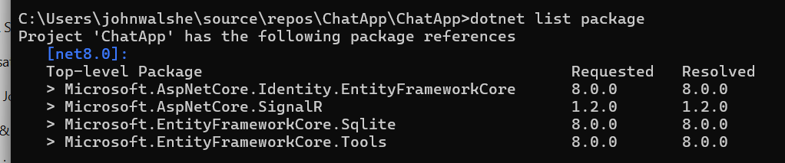

---

### Containing and Injecting Services


ASP.NET Core simplifies service integration with its built-in **Dependency Injection (DI)** framework. Using the `Services` property of the `WebApplicationBuilder` class, I registered services like **Identity** and **SignalR**. These services are injected into necessary components, ensuring modular and maintainable architecture.

```csharp
public class Program
{
    public static void Main(string[] args)
    {
        var builder = WebApplication.CreateBuilder(args);

        // Register services
        builder.Services.AddDbContext<AppDbContext>(options => 
            options.UseSqlite(builder.Configuration.GetConnectionString("DefaultConnection")));
        builder.Services.AddSignalR();
        builder.Services.AddIdentity<IdentityUser, IdentityRole>()
            .AddEntityFrameworkStores<AppDbContext>();

        var app = builder.Build();

        app.UseAuthentication();
        app.UseAuthorization();
        app.MapHub<ChatHub>("/chatHub");

        app.Run();
    }
}
```

---

### Connecting the Database


In `.NET`, the `appsettings.json` file manages database connections, defined in the `ConnectionStrings` section. Below is the configuration for SQLite:

```json
{
  "ConnectionStrings": {
    "DefaultConnection": "Data Source=ChatApp.db"
  }
}
```

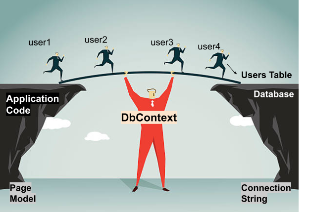

`DbContext` acts as the bridge between the app and the database, managing connections, tracking changes, and performing CRUD operations. To configure it:

1. Register it with `AddDbContext` for dependency injection.
2. Use `AddEntityFrameworkStores` for **Identity**-related tables (e.g., `AspNetUsers`).

---

### Migrations and Identity Services

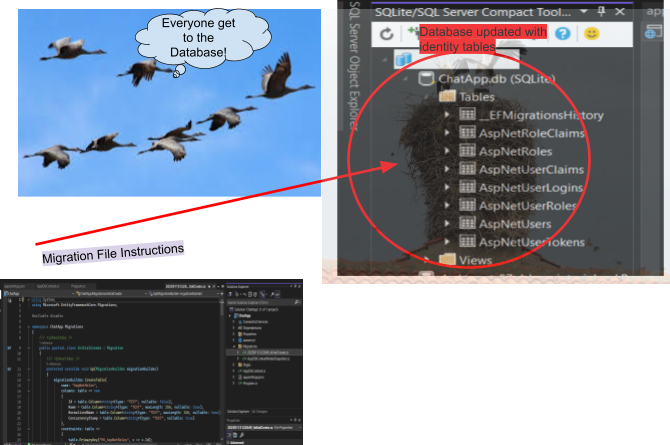

With the database linked, I used **Entity Framework Core** to manage and structure the database. First, I created migrations:
```shell
dotnet ef migrations add InitialCreate
```

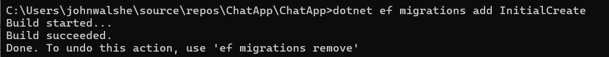

Then, I updated the database:
```shell
dotnet ef database update
```

**Outcome**: A new SQLite file (`ChatApp.db`) was created in the project directory to store user information.  

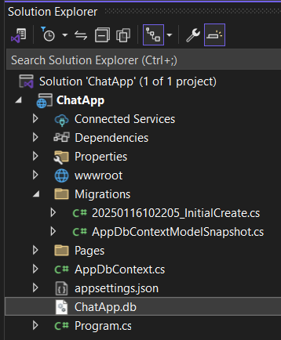
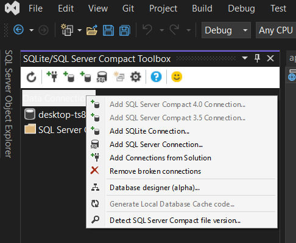


---

**Recap**: After linking the database and applying migrations, I successfully generated necessary tables (e.g., `AspNetUsers`) using Entity Framework Core. Tools like the SQLite Visual Studio Extension allowed me to inspect and verify the database structure.

---

## SECTION 2: RUNNING THE PROJECT

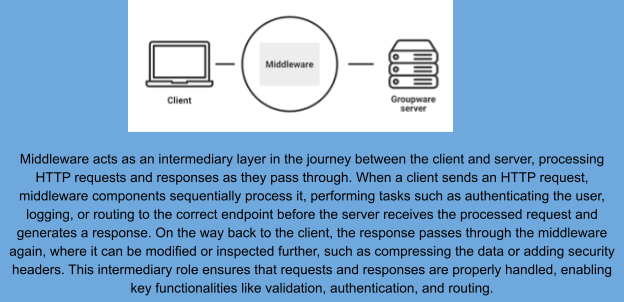

### Middleware Configuration

To handle authentication, authorization, and routing, I added middleware in `Program.cs`:

```csharp
var app = builder.Build();

app.UseRouting();
app.UseAuthentication();
app.UseAuthorization();
app.MapHub<ChatHub>("/chatHub");

app.Run();
```

The **middleware pipeline** ensures proper handling of incoming requests before routing them to Razor Pages or SignalR hubs.

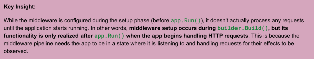

---

### Razor Pages and Identity System

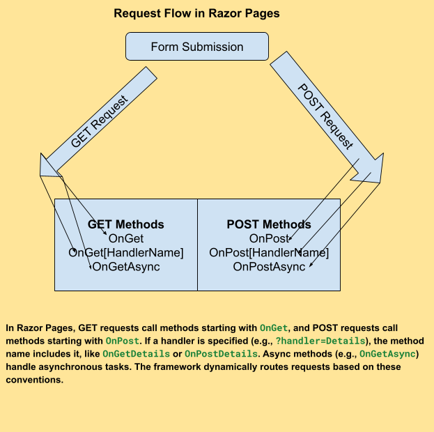

To manage user interaction (e.g., login, registration), I created **Razor Pages**:

- **Register.cshtml**: A registration page using `UserManager` to create and store user details securely.
- **Login.cshtml**: A login page using `SignInManager` for authentication.
- **Logout.cshtml**: A logout page using `SignOutAsync` to invalidate authentication cookies.

---

## SECTION 3: SignalR Integration

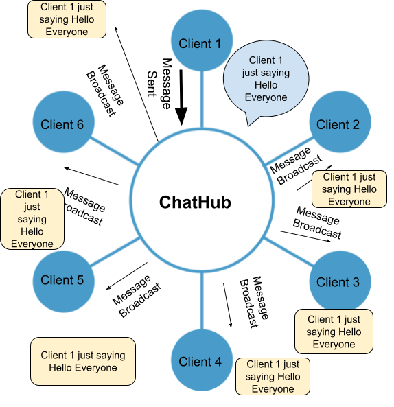

### ChatHub Setup

The `ChatHub` class serves as the real-time communication hub. It broadcasts messages to all connected clients using SignalR:

```csharp
public class ChatHub : Hub
{
    public async Task SendMessage(string user, string message)
    {
        await Clients.All.SendAsync("ReceiveMessage", user, message);
    }
}
```

**Client-Side SignalR Setup**:  
In `Chat.cshtml`, JavaScript connects to the SignalR hub, sending and receiving messages in real-time:

```javascript
const connection = new signalR.HubConnectionBuilder()
    .withUrl("/chatHub")
    .build();

connection.on("ReceiveMessage", (user, message) => {
    const msg = `${user}: ${message}`;
    const li = document.createElement("li");
    li.textContent = msg;
    document.getElementById("messagesList").appendChild(li);
});

connection.start();
```

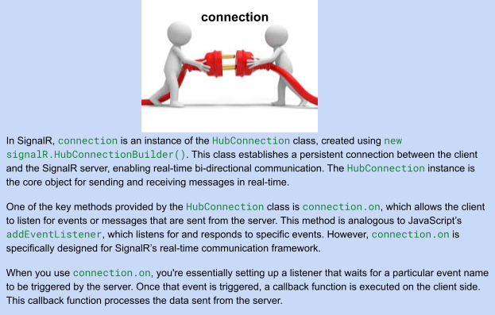

---

**Testing SignalR**:  

I tested real-time communication by logging in as different users in multiple browsers. Messages were successfully sent and received in real-time, confirming SignalR’s functionality.

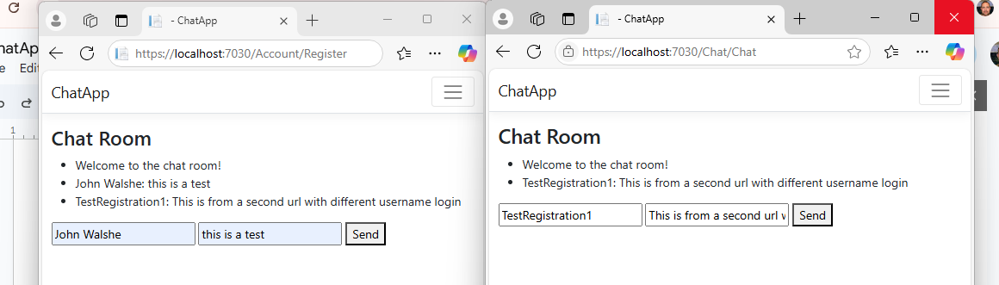

---

## Future Plans

To expand this project:

1. **Persistent Message Storage**: Save messages to the database.
2. **Real-Time User Updates**: Notify clients when users join or leave.
3. **Private Messaging**: Enable one-on-one conversations.
4. **Rich Media**: Support file uploads and multimedia sharing.
5. **Testing and Deployment**: Add automated tests and deploy to Azure.

---

This project has been a rewarding experience, enhancing my skills in **C#**, **ASP.NET Core**, and **real-time applications**. Looking forward to taking it further!
```
